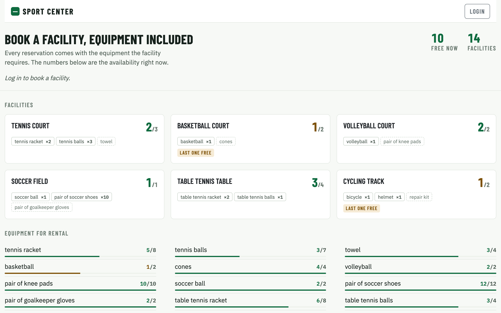
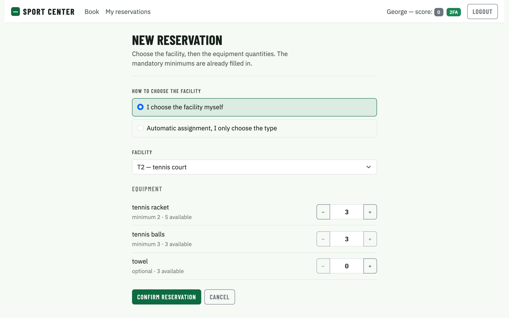
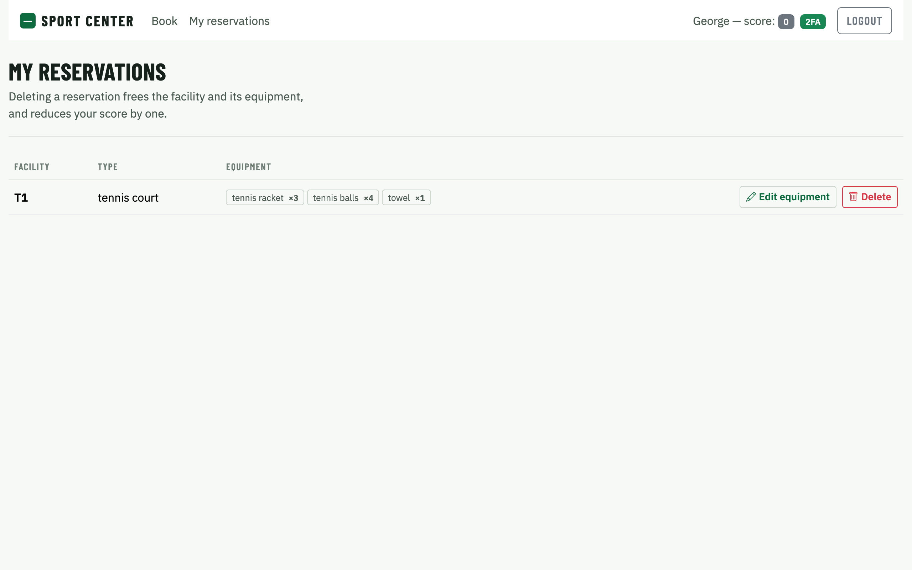
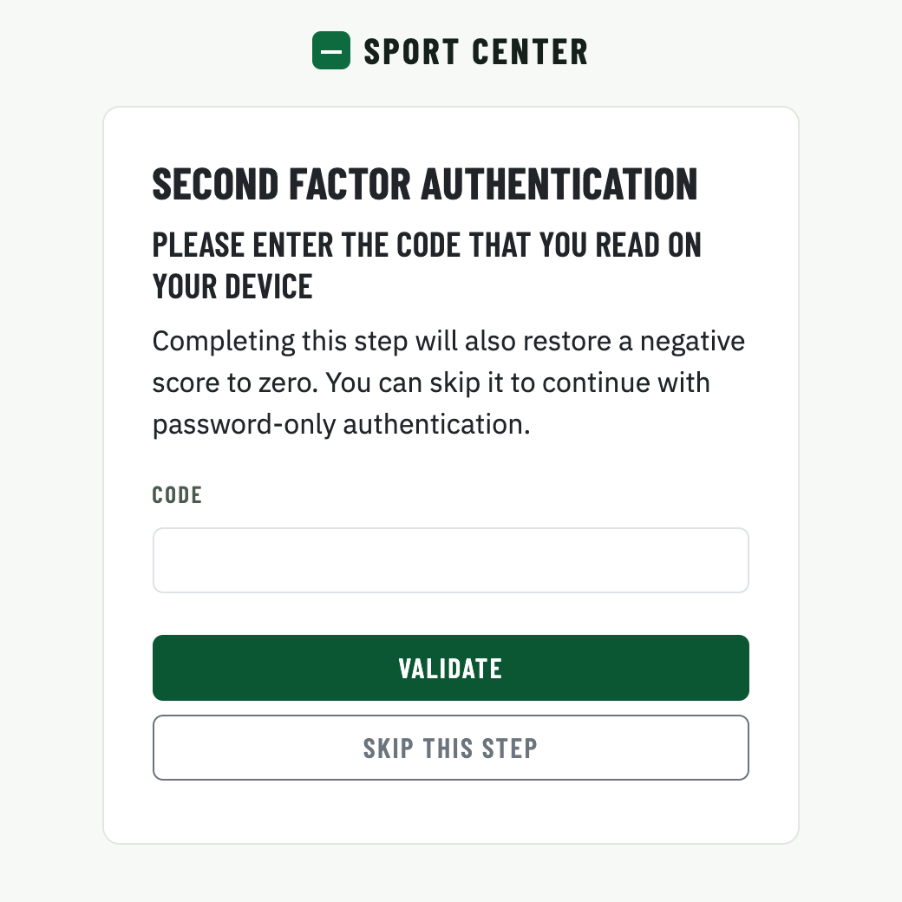

# Sport Facilities Booking


A full-stack web application for booking the facilities of a sport center (tennis courts, basketball
courts, cycling tracks, ...) together with the equipment to rent. Users log in with username and
password plus an optional TOTP second factor, book a facility directly or let the system assign a free
one, and add, change or remove equipment within the center's stock.

It was built as the individual project for the *Web Applications* course at Politecnico di Torino
(2026) and then reviewed and hardened for publication: see [Security notes](#security-notes).
The code submitted for the exam is tagged [`v1.0-exam`](https://github.com/Filippo-F/sport-facilities-booking/tree/v1.0-exam),
and every change made afterwards is a separate commit
([see all changes](https://github.com/Filippo-F/sport-facilities-booking/compare/v1.0-exam...main)).

<table>
  <tr>
    <td colspan="2" align="center" valign="top">
      <b>Availability at a glance</b><br>
      <sub>Public home page: free facilities per type and the live stock of every rentable item, no login needed.</sub>
    </td>
  </tr>
  <tr>
    <td colspan="2" align="center" valign="top">
      <a href="img/home.png"></a>
    </td>
  </tr>
  <tr>
    <td width="50%" align="center" valign="top">
      <b>Booking with equipment</b><br>
      <sub>Pick a facility or let the system assign one. Mandatory minimums are prefilled, and the quantities stop at the minimum and at the available stock.</sub>
    </td>
    <td width="50%" align="center" valign="top">
      <b>Managing reservations</b><br>
      <sub>Change the equipment of a reservation in a single request, or delete it, which lowers the score by one.</sub>
    </td>
  </tr>
  <tr>
    <td width="50%" align="center" valign="top">
      <a href="img/booking.png"></a>
    </td>
    <td width="50%" align="center" valign="top">
      <a href="img/reservations.png"></a>
    </td>
  </tr>
  <tr>
    <td colspan="2" align="center" valign="top">
      <b>Optional second factor</b><br>
      <sub>TOTP step after the password: each code works once, and at most 5 attempts are allowed every 5 minutes.</sub>
    </td>
  </tr>
  <tr>
    <td colspan="2" align="center" valign="top">
      <a href="img/totp.png"></a>
    </td>
  </tr>
</table>
<p align="center"><sub>Click an image to open it at full size.</sub></p>

**Stack:** React 19, React Router, React-Bootstrap, Vite · Node.js, Express 5, Passport (sessions),
express-validator, otpauth · SQLite

## Features

- **Public availability page:** free facilities per type and available quantity of every equipment item.
- **Two ways to book:** pick a specific facility, or choose only the type and get the first free one.
- **Equipment rules:** each facility type has mandatory equipment with a minimum quantity (a tennis court
  needs at least 2 rackets and 3 balls) and optional equipment. The form prefills the minimums and never
  lets the quantities go below them or above what is available.
- **Reservation management:** list, change the equipment in a single request, or delete.
- **Score system:** deleting a reservation lowers the user's score by 1 and blocks re-booking the same
  facility type for 30 seconds. With a negative score a user can only book the mandatory minimums and
  only remove equipment. Completing the TOTP step brings a negative score back to zero.
- **Two-factor authentication:** optional TOTP step after the password, compatible with any
  authenticator app.

## Getting started

Requirements: Node.js (tested with 24 and 26) and npm. Server and client run as two separate processes.

```bash
cd server
npm ci
node index.mjs          # API on http://localhost:3001
```

```bash
cd client
npm ci
npm run dev             # app on http://localhost:5173
```

The database `server/sport.db` is included and already contains the demo data.
`server/package.json` has an `allowScripts` entry for `sqlite3`: npm 12 blocks dependency install scripts
by default, and `sqlite3` needs its own to download its native binary. Without it `npm ci` succeeds but
the server cannot open the database.

### Demo users

All passwords are `pwd`.

| Username | Name | Reservations | Initial score |
|---|---|---|---|
| `u1@p.it` | John | none | 0 |
| `u2@p.it` | Alice | 1 (basketball court B1) | -1 |
| `u3@p.it` | George | 1 (tennis court T1) | 0 |
| `u4@p.it` | Laura | 2 (cycling track C1, table tennis table TT1) | -1 |

To try the second factor, add the TOTP secret `LXBSMDTMSP2I5XFXIYRGFVWSFI` to an authenticator app
(the demo users share it; real users would each have their own).

### Environment variables

| Variable | Required | Description |
|---|---|---|
| `SESSION_SECRET` | in production | Secret used to sign the session cookie. Without it the server uses a development-only fallback; with `NODE_ENV=production` it refuses to start. |
| `CORS_ORIGIN` | no | The only origin allowed to call the API with credentials. Defaults to `http://localhost:5173`, the Vite dev server. |
| `NODE_ENV` | no | `production` requires `SESSION_SECRET` and makes the session cookie HTTPS-only. |

Example: `SESSION_SECRET="$(openssl rand -hex 32)" NODE_ENV=production node index.mjs`

## Security notes

**Authentication and sessions**
- Passwords are stored as scrypt hashes with a per-user salt and compared with `crypto.timingSafeEqual`.
- Login errors are generic: they never reveal whether the username or the password was wrong.
- Server-side sessions (express-session + Passport). The session stores only the user id: everything
  else, including the TOTP secret, is reloaded from the database at each request and never sent to the client.
- Session cookie: `HttpOnly`, `SameSite=Lax` (CSRF protection), `Secure` in production, 2-hour lifetime.
  The signing secret comes from the environment, and the server refuses to start in production without it.
- A session whose user no longer exists is dropped instead of being treated as authenticated.

**Second factor (TOTP)**
- One secret per user, stored in the database; a one-step window tolerates clock drift.
- **Replay protection:** the last accepted time step is stored, and codes from the same or older steps
  are rejected. The check and the update are a single `UPDATE ... WHERE lastTotpStep < ?`, so two parallel
  requests with the same code cannot both succeed.
- **Brute-force limit:** at most 5 attempts every 5 minutes per user. The attempt is counted in the database
  *before* the code is checked, so parallel requests are limited too (tested: of 50 simultaneous requests,
  exactly 5 reach the verification).
- The session is marked as 2FA-authenticated only after the database writes succeed.
- The same status and message are used for a wrong code and for a user without TOTP.

**Authorization**
- The user id always comes from the session, never from the request. Every reservation operation checks
  ownership, and the delete queries also filter by `userId`. Other users' reservations get a 404, the same
  as reservations that do not exist.

**Input and errors**
- Every request is validated with express-validator (types, ranges, duplicates, TOTP code as exactly 6 digits);
  all SQL queries are parameterized.
- A final error handler turns malformed JSON into a 400 and any unexpected error into a generic 500, so
  stack traces and file paths never reach the client. Database errors during login no longer crash the process.
- CORS allows a single configured origin with credentials, never a wildcard.

**Data consistency**
- A `UNIQUE` constraint makes it impossible to book the same facility twice, and foreign keys are enforced.
- Equipment has no such constraint, and two simultaneous bookings could together rent more than exists
  (reproduced: 10 balls rented out of 7). Operations that change reservations now run one at a time.

## Known limitations

- **Single process:** the serialization of reservation changes lives in the Node process. Running several
  server instances would need database transactions or a database with row-level locking.
- **In-memory sessions:** express-session's default MemoryStore loses sessions on restart and is not meant
  for production; a persistent store (e.g. SQLite- or Redis-backed) would replace it.
- **TOTP lockout:** someone who knows a user's password can lock that user's TOTP step for 5 minutes. This is
  the accepted trade-off, since locking the password login instead would let anyone block any account; in
  this app the TOTP step can also be skipped.
- **No HTTPS in development:** in production the app is meant to sit behind a reverse proxy terminating TLS,
  which also needs `app.set('trust proxy', 1)` for the `Secure` cookie.
- **No automated tests:** the behaviours above were verified manually with scripted requests.

## Client routes

- `/`: public page with the availability of facilities and equipment.
- `/login`: login form, followed by the optional TOTP screen.
- `/book`: new reservation. Requires authentication.
- `/reservations`: the user's reservations, with edit and delete. Requires authentication.
- `/reservations/:id/edit`: change the equipment of a reservation. Requires authentication.
- `*`: not-found page.

## API reference

Error responses always have the shape `{ "error": "<message>" }`:

| Status | Meaning |
|---|---|
| 400 | malformed JSON body |
| 401 | missing or invalid authentication (generic message) |
| 404 | the resource does not exist **or belongs to another user** (the two cases are indistinguishable) |
| 409 | business rule violation; the message explains it (not enough equipment, facility already booked, too early to book again) |
| 422 | input validation error |
| 429 | too many TOTP attempts |
| 500 | internal error; details only in the server log, never in the response |

### Public

- GET `/api/types`
  - Facility types with total and currently available facilities, and the equipment allowed for each type (`minQty` = 0 means optional).
  - Response: `[{ "id": 1, "name": "tennis court", "total": 3, "available": 2, "equipment": [{ "id": 1, "name": "tennis racket", "minQty": 2 }, ...] }, ...]`

- GET `/api/equipment`
  - Equipment types with total stock and currently available quantity.
  - Response: `[{ "id": 2, "name": "tennis balls", "stock": 7, "available": 3 }, ...]`

### Authentication

- POST `/api/sessions`
  - Login with username and password. The generic 401 message does not reveal which of the two is wrong.
  - Request: `{ "username": "u2@p.it", "password": "pwd" }`
  - Response: `{ "id": 2, "username": "u2@p.it", "name": "Alice", "score": -1, "canDoTotp": true, "isTotp": false }`

- POST `/api/login-totp`
  - Second authentication step: verifies a 6-digit TOTP code for the logged-in user. On success the session is marked as fully 2FA-authenticated and a negative score is reset to zero. Codes already used (same or older TOTP step) are rejected.
  - Request: `{ "code": "123456" }`
  - Response: `{ "otp": "authorized", "score": 0 }` — 401 on invalid or reused code (also when the user has no TOTP secret, so the answer does not reveal it), 422 if the code is not exactly 6 digits, 429 after 5 attempts in 5 minutes (the attempt is counted before the code is checked, so parallel requests are limited too).

- GET `/api/sessions/current`
  - Returns the current session user, 401 if no active session.
  - Response: same shape as login.

- DELETE `/api/sessions/current`
  - Logout, destroys the current session.

### Reservations (authenticated)

- GET `/api/facilities`
  - All facilities with their type and current availability, used for direct facility selection.
  - Response: `[{ "code": "T1", "typeId": 1, "type": "tennis court", "available": false }, ...]`

- GET `/api/reservations`
  - Reservations of the current user (taken from the session, never from the request), each with its rented equipment.
  - Response: `[{ "id": 2, "facilityCode": "T1", "typeId": 1, "type": "tennis court", "equipment": [{ "id": 1, "name": "tennis racket", "quantity": 3 }, ...] }, ...]`

- POST `/api/reservations`
  - Creates a reservation in a single request. Exactly one of `facilityCode` (direct selection) or `typeId` (automatic assignment of a free facility of that type) must be provided. `equipment` lists the total requested quantities and must include every mandatory equipment of the facility type at least at its minimum; users with a negative score can only request the exact mandatory minimums. The request fails if the facility (or the whole type) is not available, if any equipment quantity exceeds the current availability, or if the user deleted a reservation of the same facility type less than 30 seconds ago.
  - Request: `{ "facilityCode": "T2", "equipment": [{ "id": 1, "quantity": 2 }, { "id": 2, "quantity": 3 }] }` or `{ "typeId": 5, "equipment": [...] }`
  - Response: `201` with the created reservation, same shape as GET `/api/reservations` items.

- PUT `/api/reservations/:id`
  - Replaces the equipment of one of the current user's reservations with the provided list (add and/or remove in one request). Mandatory minimums can never be removed; quantity increases are checked against current availability; users with a negative score can only remove equipment (no new items, no quantity increases with respect to the current reservation).
  - Request: `{ "equipment": [{ "id": 1, "quantity": 4 }, { "id": 2, "quantity": 3 }] }`
  - Response: `200` with the updated reservation.

- DELETE `/api/reservations/:id`
  - Deletes one of the current user's reservations, restoring facility and equipment availability. The user's score is decreased by 1 and the deletion time is recorded to enforce the 30-second rule on that facility type.
  - Response: `200` with empty body.


## Database tables

- Table `users` - registered users and their credentials: `id`, `email`, `name`, `hash`, `salt`, `secret` (TOTP), `lastTotpStep`, `score`.
- Table `facilityTypes` - the categories of facility offered by the sport center: `id`, `name`.
- Table `facilities` - the physical facilities, one row each, identified by a short code: `code`, `typeId`.
- Table `equipmentTypes` - the equipment available for rental with the total amount owned by the center: `id`, `name`, `stock`.
- Table `typeEquipment` - which equipment is allowed for each facility type and its minimum quantity (0 = optional): `facilityTypeId`, `equipmentTypeId`, `minQty`.
- Table `reservations` - the active reservations, one row per booked facility: `id`, `userId`, `facilityCode` (unique, so a facility cannot be booked twice).
- Table `reservationEquipment` - the equipment rented within each reservation: `reservationId`, `equipmentTypeId`, `quantity`.
- Table `totpAttempts` - TOTP attempts of each user in the current 5-minute window, to limit brute force on the second factor: `userId`, `attempts`, `windowStart`.
- Table `releases` - the last time a user deleted a reservation of a given facility type, to enforce the 30-second rule: `userId`, `facilityTypeId`, `releasedAt`.

Foreign keys are enforced (`PRAGMA foreign_keys = ON` in `server/db.mjs`). The schema and the seed data are in `server/sport.sql`; `server/sport.db` is the ready-to-use database built from it.

## Main React components

- `App` (`App.jsx`): holds the application state (authentication, availability, reservations, loading flags,
  messages) and defines the routes; every operation reloads the data from the server.
- `Home` (`Home.jsx`): public page, one card per facility type with its availability and equipment.
- `BookingForm` (`BookingForm.jsx`): new reservation with the two selection modes; prefills the minimums
  and keeps every quantity between the minimum and the available amount.
- `Reservations` and `EditReservation` (`Reservations.jsx`): list of the user's reservations with inline
  delete confirmation, and the equipment editing form.
- `LoginForm` and `TotpForm` (`Auth.jsx`): the two authentication screens; the second can be skipped.
- `Navigation` (`Navigation.jsx`): navigation bar with the current user, score, 2FA badge and login/logout.

## Author

Filippo Ferrari · [GitHub](https://github.com/Filippo-F) · [LinkedIn](https://www.linkedin.com/in/ferrari-f/)
