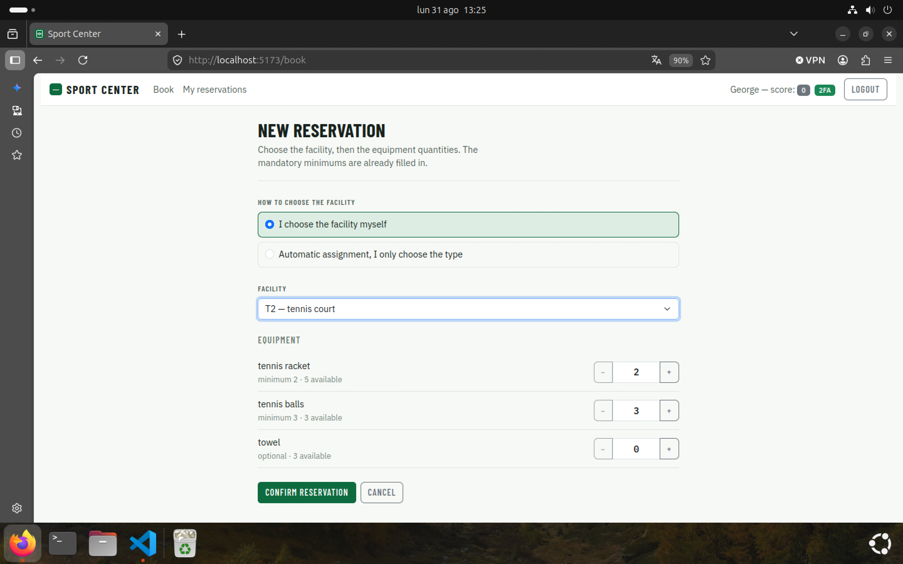

# Exam #3: "Sport"

## React Client Application Routes

- Route `/`: first page, public. Shows the number of available facilities for each type and the currently available quantity of each equipment type.
- Route `/login`: login form; after the username/password step it shows the TOTP form on a separate screen, which can be skipped.
- Route `/book`: creation of a new reservation, choosing the facility directly or by type (automatic assignment) plus the equipment quantities. Requires authentication.
- Route `/reservations`: list of the reservations of the logged-in user, with the buttons to edit the equipment or delete a reservation. Requires authentication.
- Route `/reservations/:id/edit`: form to change the equipment quantities of the reservation with the given id. Requires authentication.
- Route `*`: page shown for any non-existing route.

## API Server

Error responses always have the shape `{ "error": "<message>" }`. Validation errors use status 422, business rule violations use status 409 (the message explains the reason, e.g. not enough equipment, facility already booked, too early to book again), missing or invalid authentication uses 401, resources that do not exist or do not belong to the current user use 404.

### Public

- GET `/api/types`
  - Facility types with total and currently available facilities, and the equipment allowed for each type (`minQty` = 0 means optional).
  - Response: `[{ "id": 1, "name": "tennis court", "total": 3, "available": 2, "equipment": [{ "id": 1, "name": "tennis racket", "minQty": 2 }, ...] }, ...]`

- GET `/api/equipment`
  - Equipment types with total stock and currently available quantity.
  - Response: `[{ "id": 2, "name": "tennis balls", "stock": 7, "available": 3 }, ...]`

### Authentication

- POST `/api/sessions`
  - Login with username and password. The generic 401 message does not reveal which of the two is wrong.
  - Request: `{ "username": "u2@p.it", "password": "pwd" }`
  - Response: `{ "id": 2, "username": "u2@p.it", "name": "Alice", "score": -1, "canDoTotp": true, "isTotp": false }`

- POST `/api/login-totp`
  - Second authentication step: verifies a 6-digit TOTP code for the logged-in user. On success the session is marked as fully 2FA-authenticated and a negative score is reset to zero. Codes already used (same or older TOTP step) are rejected.
  - Request: `{ "code": "123456" }`
  - Response: `{ "otp": "authorized", "score": 0 }` — 401 on invalid or reused code, 429 after 5 attempts in 5 minutes (the attempt is counted before the code is checked, so parallel requests are limited too).

- GET `/api/sessions/current`
  - Returns the current session user, 401 if no active session.
  - Response: same shape as login.

- DELETE `/api/sessions/current`
  - Logout, destroys the current session.

### Reservations (authenticated)

- GET `/api/facilities`
  - All facilities with their type and current availability, used for direct facility selection.
  - Response: `[{ "code": "T1", "typeId": 1, "type": "tennis court", "available": false }, ...]`

- GET `/api/reservations`
  - Reservations of the current user (taken from the session, never from the request), each with its rented equipment.
  - Response: `[{ "id": 2, "facilityCode": "T1", "typeId": 1, "type": "tennis court", "equipment": [{ "id": 1, "name": "tennis racket", "quantity": 3 }, ...] }, ...]`

- POST `/api/reservations`
  - Creates a reservation in a single request. Exactly one of `facilityCode` (direct selection) or `typeId` (automatic assignment of a free facility of that type) must be provided. `equipment` lists the total requested quantities and must include every mandatory equipment of the facility type at least at its minimum; users with a negative score can only request the exact mandatory minimums. The request fails if the facility (or the whole type) is not available, if any equipment quantity exceeds the current availability, or if the user deleted a reservation of the same facility type less than 30 seconds ago.
  - Request: `{ "facilityCode": "T2", "equipment": [{ "id": 1, "quantity": 2 }, { "id": 2, "quantity": 3 }] }` or `{ "typeId": 5, "equipment": [...] }`
  - Response: `201` with the created reservation, same shape as GET `/api/reservations` items.

- PUT `/api/reservations/:id`
  - Replaces the equipment of one of the current user's reservations with the provided list (add and/or remove in one request). Mandatory minimums can never be removed; quantity increases are checked against current availability; users with a negative score can only remove equipment (no new items, no quantity increases with respect to the current reservation).
  - Request: `{ "equipment": [{ "id": 1, "quantity": 4 }, { "id": 2, "quantity": 3 }] }`
  - Response: `200` with the updated reservation.

- DELETE `/api/reservations/:id`
  - Deletes one of the current user's reservations, restoring facility and equipment availability. The user's score is decreased by 1 and the deletion time is recorded to enforce the 30-second rule on that facility type.
  - Response: `200` with empty body.

## Database Tables

- Table `users` - registered users and their credentials: `id`, `email`, `name`, `hash`, `salt`, `secret` (TOTP), `lastTotpStep`, `score`.
- Table `facilityTypes` - the categories of facility offered by the sport center: `id`, `name`.
- Table `facilities` - the physical facilities, one row each, identified by a short code: `code`, `typeId`.
- Table `equipmentTypes` - the equipment available for rental with the total amount owned by the center: `id`, `name`, `stock`.
- Table `typeEquipment` - which equipment is allowed for each facility type and its minimum quantity (0 = optional): `facilityTypeId`, `equipmentTypeId`, `minQty`.
- Table `reservations` - the active reservations, one row per booked facility: `id`, `userId`, `facilityCode` (unique, so a facility cannot be booked twice).
- Table `reservationEquipment` - the equipment rented within each reservation: `reservationId`, `equipmentTypeId`, `quantity`.
- Table `totpAttempts` - TOTP attempts of each user in the current 5-minute window, to limit brute force on the second factor: `userId`, `attempts`, `windowStart`.
- Table `releases` - the last time a user deleted a reservation of a given facility type, to enforce the 30-second rule: `userId`, `facilityTypeId`, `releasedAt`.

## Main React Components

- `App` (in `App.jsx`): main container, holds the application state (authentication, availability, reservations, loading flags, last message) and defines the routes; all the operations reload the data from the server.
- `Home` (in `Home.jsx`): public first page, shows one card per facility type with its availability and required equipment, and the available quantity of every equipment type.
- `BookingForm` (in `BookingForm.jsx`): creation of a reservation with the two selection mechanisms, prefills the mandatory minimum quantities and blocks them for users with a negative score.
- `Reservations` (in `Reservations.jsx`): table of the reservations of the user, with inline confirmation before a deletion.
- `EditReservation` (in `Reservations.jsx`): form to add or remove equipment of an existing reservation, never below the mandatory minimums.
- `LoginForm` and `TotpForm` (in `Auth.jsx`): the two authentication screens, the second one optional.
- `TotpForm` (in `Auth.jsx`): second authentication screen, verifies the TOTP code and can be skipped.
- `Navigation` (in `Navigation.jsx`): navigation bar with the current user, the score and the login/logout buttons.

## Screenshot

## Users Credentials

The TOTP secret is the same for all the users: `LXBSMDTMSP2I5XFXIYRGFVWSFI`.

| username | password | name | reservations | initial score |
|---|---|---|---|---|
| `u1@p.it` | `pwd` | John | none | 0 |
| `u2@p.it` | `pwd` | Alice | 1 (basketball court B1) | -1 |
| `u3@p.it` | `pwd` | George | 1 (tennis court T1) | 0 |
| `u4@p.it` | `pwd` | Laura | 2 (cycling track C1, table tennis table TT1) | -1 |

## Note

- `server/package.json` includes an `allowScripts` entry for `sqlite3`: npm 12 blocks the install scripts of dependencies by default, and `sqlite3` needs its own to obtain the compiled native binary. Without it `npm ci` succeeds but the server cannot open the database.

## Environment variables

| Variable | Required | Description |
|---|---|---|
| `CORS_ORIGIN` | no | The only origin allowed to call the API with credentials. Defaults to `http://localhost:5173`, the Vite dev server. |
| `SESSION_SECRET` | in production | Secret used to sign the session cookie. Without it the server uses a development-only fallback; with `NODE_ENV=production` it refuses to start. |

Example: `SESSION_SECRET="$(openssl rand -hex 32)" node index.mjs`
